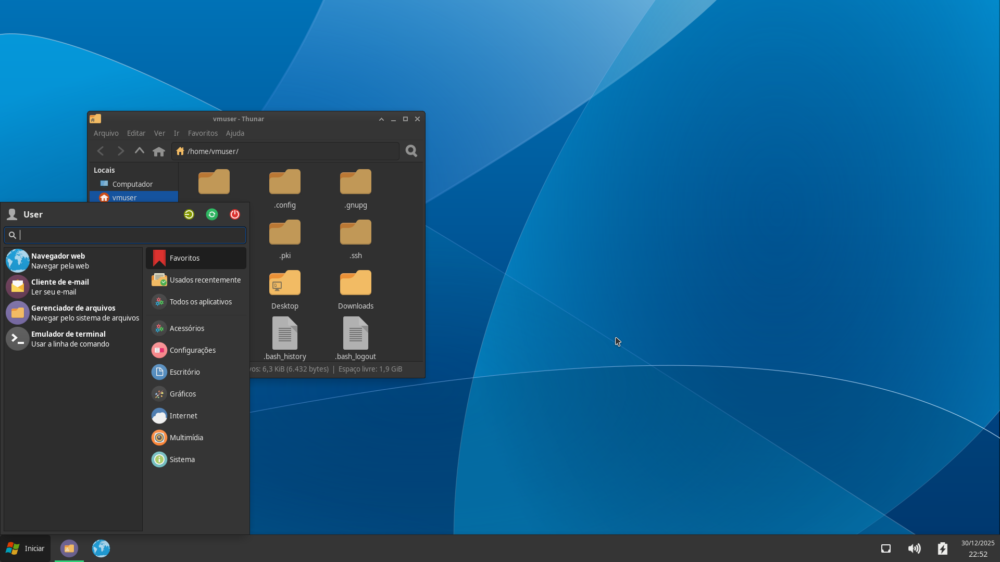
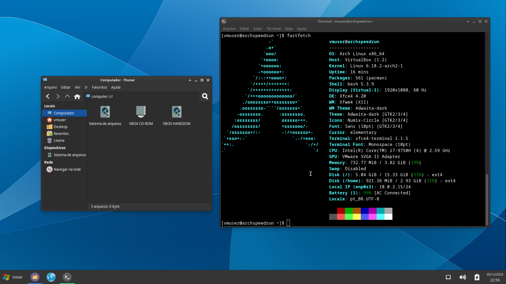
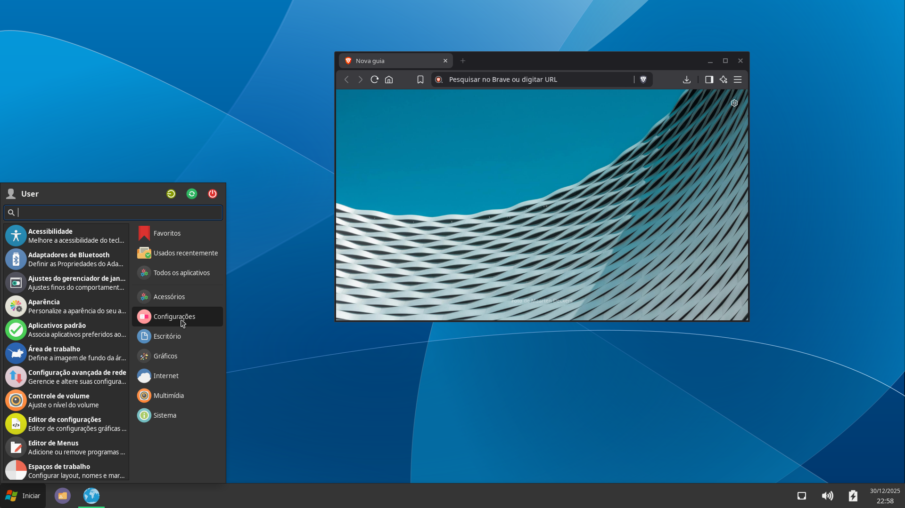

XFCE Windows Replacer
=====================

- Install and configure Arch with XFCE and SUDO
- Log into the XFCE session
- CD into the project folder with your terminal (important!)
- Run `./run.sh`

It will look like this:

